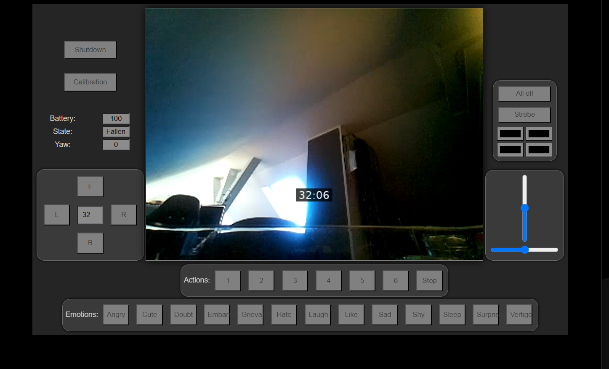

# XGORider - RiderPI Software

# PreAlpha Phase !!!!!!!!!
 
This is a lightweight kernel module for the xgorider/riderpi. The provided python scripts are shitty as hell, slow and dumb.
And yes I know that accessing a tty via /dev is not the 'right' way !!! Right way is to develop a platform driver. You are free to do.

The Software ist divided into parts:
* The Kernel Module
* The Display Driver
* The Remote Control Host
* The Remote Control Client
* RTMP Server for low latency video

## The Kernel Module

Features:
* /proc filesystem
* shutdown on low power
* always keep yaw, when move forward/backward
* manage buttons 

## /proc Filesystem
Basedir: /proc/XGORider

In this dir you can find for reading:
* yaw
* state
* buttons 1=A, 2=B, 3= A+B etc
* battery in %


for writing:

| file                          | format | description                                 |
|-------------------------------|--------|---------------------------------------------|
| action                        | Number | Start specified action                      |
| yaw                           | Number | Get Yaw                                     |
| roll                          | Number | set the roll angle                          |
| height                        | Number | set Bodyheight                              |
| leds/0                        | Color  | set led1 color #000000                      |
| leds/1                        | Color  | set led2 color                              |
| leds/2                        | Color  | set led3 color                              |
| leds/3                        | Color  | set led4 color                              |
| settings/shutdown_on_low_batt | 0\|1   | shutdown system when batt is under low_batt |
| settings/low_batt             | 0-100  | low watermark in %                          |
| settings/verbose              | Number | see verbose levels                          |
| settings/sleep_ms_on_loop     | Number | ms sleep in main loop                       |
| settings/force_yaw            | 0\|1   | hold yaw, under all circumstances           |
| settings/calibration          | 0\|1   | start calibration                           |


The values are refreshed in the Background via a Kernel Thread, so no blocking etc.
Values are only refreshed when in balanced mode. If not only state is refreshing.

### verbose level
bitwise
* 1 serial
* 2 gpio
* 4 proc
* 8 main

### Calibration
see (https://wiki.elecfreaks.com/en/microbit/robot/xgo-rider-kit/cases-libraries/case08-calibration-mode)

### important
Because of security, you can't set baudrate in kernel driver.
This is done in rc.local.


### Shutdown on less power
When battery is under low_batt the system do poweroff. So no filesystem damage.

### Shutdown on Buttons
You can shutdown, if you press Button A and Button B 3 Seconds. 


## The Display Driver
It is a userspace daemon which creates a fifo /tmp/lcd0

You can send raw bitmap RGB565.

For Example:

``
ffmpeg -y -re -i [INPUT_FILE] -s 320x240 -f rawvideo -pix_fmt rgb565 /tmp/lcd0
``

## The Remote Control

### Check your DHCP/DNS 
SSL Certs are bind to domainname, so you had to configure your DHCP to deploy a suffix.
It should look like:

````
C:\Windows\System32>ping riderpi

Ping wird ausgeführt für riderpi.intern.itnox.de [192.168.53.110] mit 32 Bytes Daten:
Antwort von 192.168.53.110: Bytes=32 Zeit<1ms TTL=64
````

### First connect
The URL is: http://riderpi:1080

Because of security limitation, you need a certificate. I had already included one, but you need to download and install the matching CA in your browser.
You will automatically redirected to do that. When the CA is installed you will be automatically redirected to the interface. 


### The Interface



Features
* Navigate
* Realtime Audio/Video
* Set Leds
* Play Emotions
* Play Actions

### Node Server
Node is used for small RTMP Server

### RTMP Server
nginx mod rtmp is used

### WebClient
WebRTMP is used for low latency video. (https://github.com/aeinstein/webrtmp)

